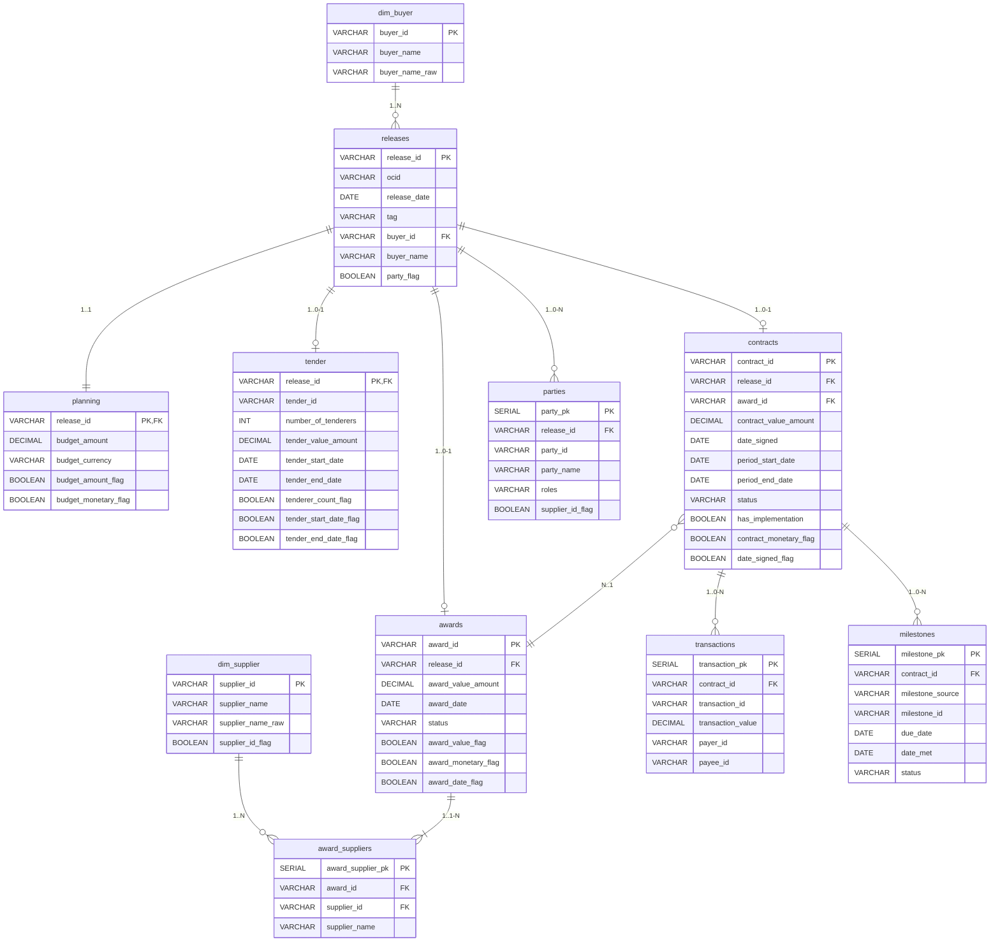

# NOCOPO Entity-Relationship Diagram

This document contains the Entity-Relationship Diagram for the NOCOPO relational model, including both staging (`stg`) and core dimension (`core`) tables.

## Diagram

## Legend
- **PK**: Primary Key
- **FK**: Foreign Key
- **1..N**: One-to-Many
- **1..1**: One-to-One
- **1..0-1**: One-to-Zero-or-One
- **1..0-N**: One-to-Zero-or-Many
